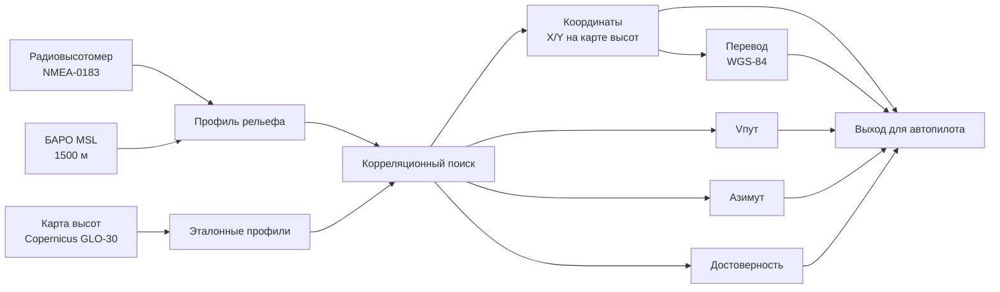
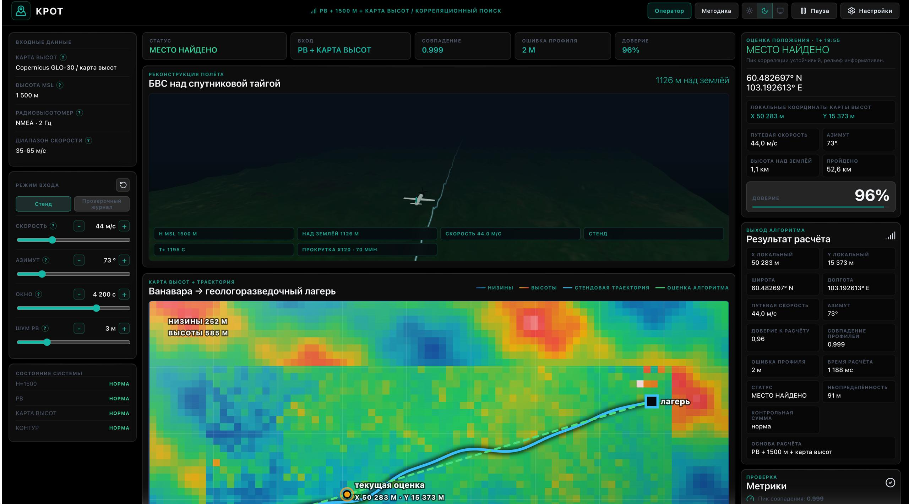
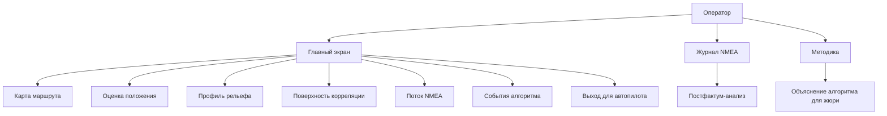
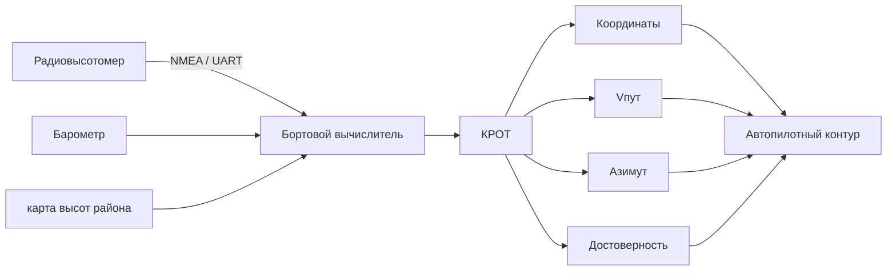

# КРОТ

## Корреляционный Рельефный Определитель Траектории

**Навигация по рельефу для полёта без ГНСС**

<p>
  <span>MVP: рабочий прототип</span> ·
  <span>GNSS: недоступна</span> ·
  <span>Вход: NMEA-0183</span> ·
  <span>Карта высот: Copernicus GLO-30</span> ·
  <span>Ядро: работает без сети</span> ·
  <span>Стек: TypeScript / React / Three.js</span>
</p>

**КРОТ** — программный прототип для хакатон-кейса **«Полёт вслепую»** от команды **«Где мы, Бариста?»**. Он восстанавливает координаты, путевую скорость и азимут воздушного судна по профилю рельефа, полученному из радиовысотомера и барометрической высоты. Решение работает с цифровой моделью рельефа и показывает не только найденное положение, но и доверие к результату.

## Главное за 15 секунд

КРОТ использует рельеф как навигационный ориентир. Радиовысотомер показывает расстояние до поверхности, барометр даёт высоту борта над уровнем моря, а их разность превращается в профиль местности под воздушным судном. Алгоритм сравнивает этот профиль с цифровой картой рельефа и находит координаты, скорость и азимут по максимуму совпадения.

## Что решает

КРОТ отвечает на четыре вопроса:

- где находится воздушное судно;
- с какой путевой скоростью оно движется;
- в каком направлении летит;
- насколько можно доверять найденной привязке.

## Поток данных



## Интерфейс

Главный экран — техническая операторская панель, а не обучающий лендинг. Учебное объяснение вынесено в режим **Методика**.





- **Оператор** — основной рабочий экран с входными данными, картой, статусом навигации и выходом расчётной части.
- **Журнал NMEA** — постфактум-анализ вставленного или загруженного `.txt/.nmea/.log` журнала радиовысотомера без передачи расчётной части истинной траектории.
- **3D-превью** — визуальный стенд полёта самолётного БВС над рельефом на WebGL/Three.js.
- **Методика** — отдельный режим объяснения алгоритма для трекеров и жюри.

## Что видно в демо

| Блок интерфейса | Что показывает |
| --- | --- |
| Карта маршрута | Истинная и найденная траектория на фоне района |
| Оценка положения | Координаты, скорость, азимут, ошибка профиля и достоверность |
| Поток NMEA | Последние сообщения радиовысотомера |
| Профиль рельефа | Сравнение измеренного профиля и эталона карты высот |
| Тепловая карта совпадений | Где алгоритм нашёл максимум совпадения |
| События алгоритма | Этапы расчёта от потока РВ до финального статуса |
| Выход для автопилота | Структурированный пакет оценки для внешнего контура |

## Как работает алгоритм

БАРО MSL — абсолютная высота борта над уровнем моря. РВ AGL — расстояние от борта до поверхности. Карта высот — сетка, где для каждой точки земли известна высота.

Главное преобразование:

```text
рельеф MSL = БАРО MSL - РВ AGL
```

Из этих данных строится измеренный профиль рельефа. Затем алгоритм перебирает возможные направления, скорости и смещения по карте. Для каждого кандидата строится эталонный профиль и считается степень совпадения. Лучший кандидат даёт локальные координаты `X/Y` в метрах на карте высот, путевую скорость и азимут. Для интерфейса и внешнего обмена локальная координата дополнительно переводится в WGS-84.

Последовательность расчёта:

1. Парсинг потока радиовысотомера в формате NMEA-0183 GGA.
2. Построение измеренного профиля рельефа по формуле `BARO - RA`.
3. Построение эталонных профилей по карте высот.
4. Перебор азимута `0-359°`.
5. Перебор путевой скорости в заданном диапазоне.
6. Перебор смещения вдоль профиля.
7. Расчёт совпадения и ошибки профиля для каждого кандидата.
8. Выбор максимума совпадения с учётом ошибки профиля.
9. Расчёт статуса навигации, достоверности и структурированного выхода.

## Карта высот

Карта высот в КРОТ — это не спутниковое фото. Это численная сетка высот земли: у каждой точки района есть значение высоты над уровнем моря. Алгоритм работает именно по этой сетке: из радиовысоты и барометрической высоты строится измеренный профиль земли, затем этот профиль сравнивается с эталонными профилями карты высот.

Основной источник данных — сохранённый в репозитории сэмпл **Copernicus DEM GLO-30 COG** для района Ванавары и Подкаменной Тунгуски. Сэмпл уже лежит в `src/copernicusDemSample.ts`, поэтому расчёт и отображение карты высот работают без сети. Сеть нужна только для повторной генерации сэмпла через `npm run dem:generate` или для спутниковой подложки в интерфейсе.

В операторском экране есть три режима карты:

| Режим | Для чего нужен |
| --- | --- |
| Карта высот | Основной режим защиты: цвет, тени и контурные линии показывают рельеф, по которому считается навигация |
| Спутниковая подложка | Визуальный ориентир по местности, может требовать сеть |
| Совмещённо | Проверка, что маршрут и найденная траектория лежат поверх того же района |

Цветовая шкала карты: низкие места показаны тёмно-зелёным, средние высоты — жёлто-коричневым, верхние участки — светло-коричневым. Легенда в интерфейсе показывает минимальную, максимальную и промежуточные высоты земли в метрах.

## Демонстрационный район

Для демонстрации выбран район Ванавары в Красноярском крае: это удалённая территория со среднетаёжным рельефом и слабой наземной инфраструктурой. Такой сценарий соответствует гражданской логистике в труднодоступные районы: геологоразведочные лагеря, метеостанции, удалённые посёлки.

В стенде используется сэмпл реальной карты высот **Copernicus DEM GLO-30 COG** для района Ванавары и Подкаменной Тунгуски.

Параметры текущего сэмпла карты высот:

| Параметр | Значение |
| --- | --- |
| Район | Красноярский край, район Ванавары |
| Границы | `60.25-60.95 N`, `102.15-105.65 E` |
| Сетка | `420 x 180` |
| Диапазон высот | `242.6-591.8 м` |
| Генератор | `scripts/generate-dem-sample.mjs` |

## Внешние NMEA-журналы

В репозитории есть два файла для режима **Журнал NMEA**:

| Файл | Назначение | Ожидаемый результат |
| --- | --- | --- |
| `examples/vanavara-success-radio-altimeter.nmea` | контрольный журнал для текущего района Ванавары | `FIX VALID`, координаты, Vпут, азимут, достоверность |
| `examples/px4-derived-radio-altimeter.nmea` | внешний PX4-derived журнал, приведённый к формату кейса | чаще `NO FIX`, потому что профиль не соответствует текущей карте высот |

`vanavara-success-radio-altimeter.nmea` — это не данные заказчика. Это заранее сохранённый контрольный журнал, сгенерированный по текущей карте высот, чтобы доказать режим постфактум-анализа: файл загружается извне, а расчётная часть получает только NMEA, карту высот и настройки. Истинная траектория используется только для генерации и описания контрольного файла, но не передаётся в `solveFromNmea`.

CLI-проверка успешного внешнего файла:

```bash
npm run nmea:analyze -- examples/vanavara-success-radio-altimeter.nmea
```

CLI-проверка отрицательного внешнего файла:

```bash
npm run nmea:analyze -- examples/px4-derived-radio-altimeter.nmea
```

## Соответствие ТЗ

| Требование | Статус | Реализация |
| --- | --- | --- |
| NMEA-0183 GGA радиовысотомера | выполнено | `src/nmeaRadioAltimeter.ts` |
| Контрольная сумма NMEA | выполнено | `nmeaChecksum`, `parseGgaRadioSentence` |
| Частота 1-10 Гц | выполнено в конфигурации | `sampleRateHz` |
| БАРО 1500 м MSL | выполнено | `DEFAULT_MATCHER_CONFIG.baroAltitudeM` |
| Профиль рельефа | выполнено | `BARO - RA`, `measuredProfile` |
| Карта высот района | выполнено для MVP | `src/copernicusDemSample.ts` |
| Перебор азимута 0-359° | выполнено | `runTerrainMatching`, `solveFromMeasuredProfile` |
| Перебор скорости | выполнено | `speedMinMps`, `speedMaxMps`, `speedStepMps` |
| Перебор смещения | выполнено | `SHIFT_CANDIDATES_M` |
| Максимум корреляции | выполнено | `scoreProfile`, выбор `bestCell` |
| Тепловая карта совпадений | выполнено | `CorrelationSurface` |
| Траектория на карте | выполнено | `SatelliteMap` |
| Журнал NMEA | выполнено | `solveFromNmea`, режим `Журнал NMEA` |
| Успешный внешний контрольный NMEA | выполнено | `examples/vanavara-success-radio-altimeter.nmea` |
| Отрицательный внешний NMEA | выполнено | `examples/px4-derived-radio-altimeter.nmea` |
| События алгоритма | выполнено | `AlgorithmEventLog`, `events` |
| Самооценка точности | выполнено | `estimateConfidence`, `navigationStatus` |
| Статусы `LOW RELIEF` / `NO FIX` | выполнено | `classifyNavigationStatus` |
| Структурированный выход | выполнено | `AutopilotOutputPanel`, `buildAutopilotOutput` |
| Рекомендательная поправка курса | выполнено | `course_correction_deg` при заданном плане и надёжном статусе |

## Практическая интеграция

На реальном борту КРОТ не заменяет автопилот. Он работает как отдельный навигационный сервис на бортовом вычислителе и выдаёт альтернативную навигационную оценку для внешнего контура.



MVP уже формирует выход:

| Поле | Значение |
| --- | --- |
| `local_x_m` / `local_y_m` | локальные координаты на карте высот, м |
| `lat` / `lon` | оценка координат WGS-84 |
| `ground_speed_mps` | путевая скорость |
| `azimuth_deg` | путевой угол |
| `confidence` | нормированная достоверность |
| `uncertainty_m` | оценка неопределённости, если статус позволяет |
| `navigation_status` | `FIX VALID`, `FIX DEGRADED`, `FIX AMBIGUOUS`, `LOW RELIEF`, `NO FIX` |
| `course_correction_deg` | рекомендательная поправка к плановой линии маршрута; `null`, если статус не позволяет выдавать совет |

Подробная схема переноса MVP на борт описана в [`docs/onboard_integration.md`](docs/onboard_integration.md).

## Rust-ядро расчёта

В папке [`rust-core`](rust-core) находится отдельная техническая реализация расчётного ядра на Rust. Она не содержит интерфейса, карты в браузере и 3D-визуализации, а выполняет только алгоритм:

```text
журнал радиовысотомера + карта высот → координаты, скорость, направление, доверие
```

Это не замена основного веб-стенда и не готовый серийный бортовой модуль. Это технический прототип расчётной части, который показывает, что алгоритм можно вынести в отдельную командную программу для будущего бортового вычислителя.

Запуск:

```bash
cd rust-core
cargo test
cargo run --release -- --dem data/dem-sample.json --nmea data/control-radio-altimeter.nmea --baro 1500
```

## Ограничения

Ограничения фиксируются явно, чтобы отделить рабочий MVP от серийного бортового изделия:

- на плоском рельефе профиль менее уникален;
- точность зависит от длины окна измерений;
- шум радиовысотомера ухудшает совпадение;
- разрешение карты высот ограничивает детализацию;
- спутниковая подложка в интерфейсе может требовать сеть, но алгоритм и сэмпл карты высот работают без неё;
- MVP не управляет рулями, тягой и стабилизацией;
- MVP не реализует отказоустойчивую логику полётного контроллера;
- MVP не привязан к конкретному серийному бортовому протоколу.

## Запуск

```bash
npm install
npm run dev
```

URL локального стенда:

```text
http://127.0.0.1:5173/
```

Проверки:

```bash
npm test
npm run build
npm run nmea:analyze -- examples/vanavara-success-radio-altimeter.nmea
npm run nmea:analyze -- examples/px4-derived-radio-altimeter.nmea
```

## Данные карты высот

Сэмпл карты высот генерируется из публичных COG-тайлов Copernicus DEM GLO-30:

```bash
npm run dem:generate
```

Команда требует сеть и перегенерирует `src/copernicusDemSample.ts`. В обычном запуске стенд использует уже сохранённый локальный сэмпл карты высот.

Источник карты высот также виден в интерфейсе: название набора, размер сетки, границы района и дата генерации показываются в панели района. Это нужно, чтобы на защите было понятно, что карта высот не нарисована вручную.

## Проверки

Smoke-тесты проверяют:

- генерацию и разбор NMEA;
- контрольную сумму NMEA;
- геопривязку маршрута в районе Ванавары;
- локальные координаты `X/Y` в выходе расчётной части;
- рекомендательную поправку курса при заданной плановой линии;
- восстановление азимута и скорости;
- построение тепловой карты совпадений;
- снижение доверия на плоском шумном рельефе;
- работу расчётной части без истинной траектории;
- успешный внешний контрольный NMEA без истинной траектории;
- импорт внешнего PX4-derived NMEA-примера;
- события расчёта и структурированный выход для автопилота;
- отказ `NO FIX` на заведомо несовместимом профиле.

## Структура проекта

| Файл | Назначение |
| --- | --- |
| `src/App.tsx` | интерфейс и режимы демо |
| `src/terrainMatcher.ts` | корреляционный поиск |
| `src/nmeaRadioAltimeter.ts` | генерация и парсинг NMEA |
| `src/copernicusDemSample.ts` | сэмпл карты высот |
| `src/FlightPreview3D.tsx` | 3D-превью |
| `src/smoke.test.ts` | smoke-тесты |
| `scripts/generate-dem-sample.mjs` | генератор сэмпла карты высот |
| `scripts/analyze-nmea.mjs` | CLI-анализ внешнего NMEA-журнала |
| `scripts/dev.mjs` | локальный dev-сервер |
| `scripts/build.mjs` | сборка в `dist` |
| `scripts/test.mjs` | запуск smoke-тестов |
| `docs/onboard_integration.md` | схема переноса на борт |
| `docs/ai/repository-knowledge-base.json` | машинно-читаемая база знаний проекта |

## AI-контекст

В репозитории есть файлы для работы AI-инструментов:

- `AGENTS.md` — правила для автономных агентов;
- `.github/copilot-instructions.md` — инструкции для GitHub Copilot;
- `docs/ai/repository-knowledge-base.json` — база знаний по продукту, архитектуре, командам и UX-ограничениям.

## Дальнейшее развитие

- несколько районов: тундра, степь, горное плато;
- потоковая подгрузка карт высот;
- ускорение поиска через WebWorker/WASM;
- фильтрация РВ/БАРО;
- экспорт отчёта постфактум-анализа;
- оценка качества привязки отдельным ML-модулем как дополнение, не как основа определения координат.

## Источники

- Copernicus DEM GLO-30 COG: URL тайлов зафиксированы в `src/copernicusDemSample.ts`.
- Encyclopedia of Ukraine: vegetation zones of Ukraine — https://www.encyclopediaofukraine.com/display.asp?linkpath=pages%5CF%5CL%5CFlora.htm
- Britannica: Taiga — https://www.britannica.com/science/taiga
- Britannica: Podkamennaya Tunguska River — https://www.britannica.com/place/Podkamennaya-Tunguska-River
