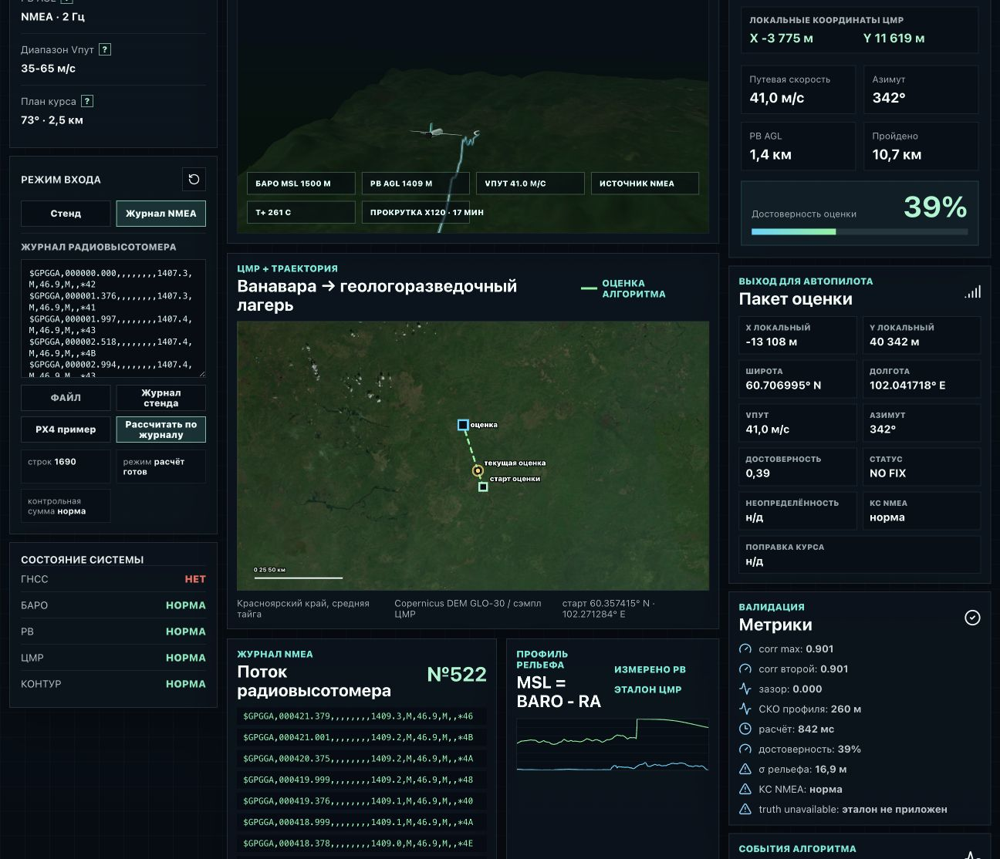

# Чекпоинт: внешний NMEA-журнал PX4

Цель проверки: показать, что режим `Проверочный журнал` принимает файл извне и запускает расчётную часть без `truthPath`, `trueSpeed`, `trueAzimuth` и сгенерированной истинной траектории.

## Вход

```text
examples/px4-derived-radio-altimeter.nmea
```

Параметры:

- строк NMEA: 1690;
- формат: `$GPGGA`;
- `BARO MSL`: 1500 м;
- поле высоты GGA используется как `RA AGL` по формату кейса;
- источник исходных данных: локальный PX4 `vehicle_gps_position` CSV, преобразованный скриптом `npm run nmea:generate-demo`.

Воспроизводимый запуск без UI:

```bash
npm run nmea:analyze -- examples/px4-derived-radio-altimeter.nmea
```

## Результат UI

| Поле | Значение |
| --- | --- |
| Навигационный статус | `NO FIX` |
| Причина | корреляционный пик не прошёл минимальные пороги качества |
| максимум совпадения | 0.9017 |
| второй пик | 0.9012 |
| зазор | 0.0004 |
| СКО профиля | 260 м |
| время расчёта | около 1.6-3.7 с на MacBook Air M3 |
| доверие к расчёту | 39% |
| σ рельефа | 16.9 м |
| truth | unavailable |
| навигационная выдача | не выдана |
| диагностический кандидат | X -13 108 м / Y 40 342 м / 41.0 м/с / 342° |
| uncertainty_m | н/д |
| compute_ms | время расчёта выводится в CLI/UI |

## Интерпретация

Для проверки используется внешний PX4-derived журнал радиовысотомера. Корректное поведение системы здесь - честный отказ `NO FIX`: внешний файл разобран, профиль построен, поиск выполнен, но совпадение с текущей картой высот неоднозначно и недостаточно качественно. Лучший кандидат оставлен только для диагностики.

Скриншот:


